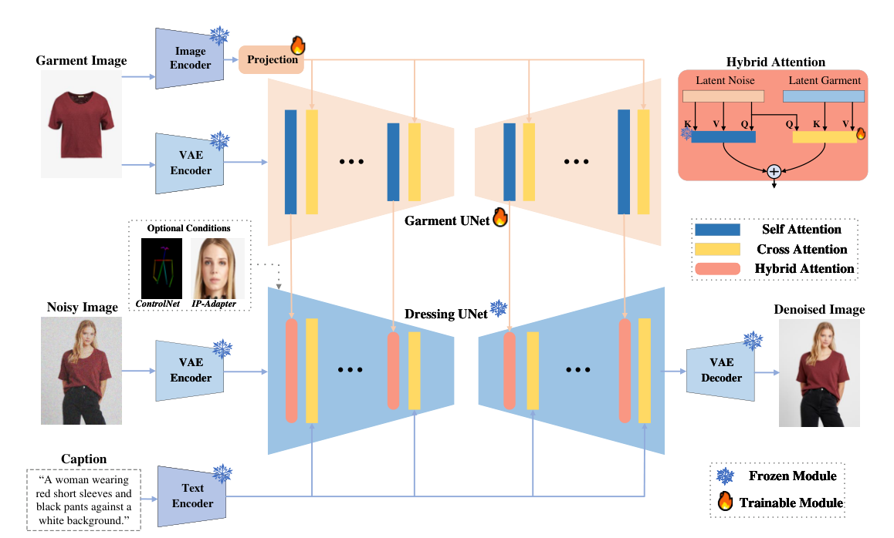

# P2G-HAI：人物图像服装还原模型

**Person-to-Garment Restoration with Hybrid Attention Injection**

基于 Stable Diffusion 1.5 与混合注意力注入（Hybrid Attention Injection）的人物图像服装还原模型。给定一张人物穿着图像，还原出对应的平铺服装图（Person → Garment，与虚拟试穿 VTON 方向相反）。相关研究成果已被 **ICITES** 录用。

本工作基于 [IMAGDressing-v1](https://github.com/muzishen/IMAGDressing)（AAAI 2025）的代码框架开展，沿用其 Garment UNet + 混合注意力（Hybrid Attention）的特征注入思路，将特征条件方向反转为「人物图 → 服装图」的还原任务，并完成了训练工程化与系统评测。

## 方法框架



- **Garment UNet（可训练）**：同时从 CLIP 捕获语义特征、从 VAE 捕获纹理特征；
- **Denoising UNet（冻结）**：通过混合注意力模块（冻结自注意力 + 可训练交叉注意力）注入服装特征，保留文本可控性；
- **P2G 还原**：以穿着图像为条件，从加噪 GT 出发重建服装图，评估还原保真度。


## 主要结果

- 在 VTON-HD 500 张测试子集上，**FID 指标较基线下降 50%**；
- 支持 DressCode 数据集上的训练与消融实验（`run_ablation_extractor_DC.ps1`）。

## 目录结构

```
├── adapter/                    # 混合注意力处理器 / Resampler（核心模块）
├── metric/                     # 评测指标实现
├── preprocess/                 # 数据预处理（humanparsing / openpose）
├── assets/figures/             # README 插图
├── train_extractor_HD.py       # 训练脚本（VTON-HD）
├── train_extractor_DC.py       # 训练脚本（DressCode）
├── train_extractor_HD_runfix.py# 训练脚本（HD 修正版）
├── evaluate_extractor.py       # 评估脚本（VTON-HD）
├── evaluate_extractor_DC.py    # 评估脚本（DressCode）
├── VTONHD.py / Dresscode.py    # 数据集定义
├── generate_prompts.py         # 生成服装文本描述（prompts 缓存）
├── create_test_subset*.py      # 构建 500 张测试子集
├── calculate_fid_kid_standard.py # FID / KID 计算
├── visualize_attention_dresscode.py  # 注意力可视化
├── profile_efficiency_dresscode.py   # 效率分析
├── run_ablation_extractor_DC.*       # 消融实验
├── app.py                      # Gradio 推理 Demo
├── run_*.ps1                   # 训练 / 评估一键脚本（PowerShell）
└── zero_stage2_config.json     # DeepSpeed ZeRO-2 配置
```

## 复现步骤

### 1. 环境准备

```bash
conda create -n IMAGDressing python=3.10 -y
conda activate IMAGDressing
# PyTorch（CUDA 12.1），按你的 CUDA 版本调整
pip install torch torchvision --index-url https://download.pytorch.org/whl/cu121
pip install -r requirements.txt
```

> 依赖要点：`diffusers==0.24.0`、`transformers==4.40.0`、`accelerate==0.29.3`、`deepspeed==0.14.1`（可选，用于 ZeRO-2 多卡训练）。
> 若未安装稳定的 xformers，训练脚本中已默认 `XFORMERS_DISABLED=1`。

### 2. 预训练权重

下载并组织到 `models/IMAGDressing/`（体积较大，未包含在本仓库）：

| 权重 | 来源 | 放置路径 |
| --- | --- | --- |
| Stable Diffusion v1.5 | `runwayml/stable-diffusion-v1-5` | `models/IMAGDressing/` |
| sd-vae-ft-mse | `stabilityai/sd-vae-ft-mse` | `models/IMAGDressing/sd-vae-ft-mse` |
| CLIP image encoder | IMAGDressing-v1 官方发布 | `models/IMAGDressing/image_encoder` |
| IP-Adapter Plus (sd15) | IMAGDressing-v1 官方发布 | `models/IMAGDressing/models/ip-adapter-plus_sd15.bin` |

### 3. 数据准备

支持三个数据集（需自行获取）：

- **VTON-HD**（`zalando-hd-resized`，[VITON-HD](https://github.com/shadow2496/VITON-HD)）
- **DressCode**（[官方申请](https://github.com/aimagelab/dress-code)）
- **IGPair**（IMAGDressing-v1 发布，30 万+ 服装-穿着图对）

```bash
# 1) 为数据集生成服装文本描述（生成 prompts_*_paired.jsonl 缓存）
python generate_prompts.py

# 2) 构建 500 张评估子集
python create_test_subset.py              # VTON-HD -> test_subset_500.json
python create_test_subset_dresscode.py    # DressCode -> test_subset_500_DC.json
```

### 4. 训练

```powershell
# VTON-HD
.\run_train_extractor_HD.ps1

# DressCode
.\run_train_extractor_DC.ps1
```

脚本内部使用 `accelerate launch --mixed_precision bf16`，关键参数：

- `--learning_rate 1e-4`、`--train_batch_size 1`、`--gradient_accumulation_steps 4`
- `--noise_offset 0.05`、`--snr_gamma 3.0`（Min-SNR 加权）
- `--save_steps 5000`、`--validation_steps 5000`
- 断点续训：`--resume_from_checkpoint <ckpt_path>`

多卡可改用 DeepSpeed ZeRO-2（`zero_stage2_config.json`）。

### 5. 评估

```powershell
# 批量评估 outputs/extractor_HD 下所有 checkpoint
.\batch_evaluate_all_models.ps1        # VTON-HD
.\batch_evaluate_all_models_DC.ps1     # DressCode
```

评估协议：从加噪 GT 重建（`from_noisy_gt`，t=600），DDIM 50 步，guidance scale 3.0，VAE 确定性解码。

```bash
# 计算 FID / KID
python calculate_fid_kid_standard.py --generated <生成图目录> --groundtruth <GT目录>
```

### 6. 推理 Demo

```bash
python app.py   # Gradio Web UI
```

### 7. 分析与消融（可选）

```bash
python visualize_attention_dresscode.py   # 注意力可视化
python profile_efficiency_dresscode.py    # 推理效率分析
.\run_ablation_extractor_DC.ps1           # 消融实验
```

## 说明

- 本仓库**仅包含代码与配置**：模型权重（55GB）、训练输出（88GB）、评估结果等均未上传，请按上文自行下载/生成。
- `train_extractor.py`（IGPair 数据集版本）依赖的 `IGPair.py` 数据集定义未随附，复现请以 `_HD` / `_DC` 脚本为主。
- `preprocess/humanparsing/mhp_extension/detectron2` 为第三方 vendored 依赖，未包含在内，如需人体解析预处理请按 [detectron2 官方文档](https://github.com/facebookresearch/detectron2) 安装。

## 引用

```bibtex
@inproceedings{shen2024imagdressing,
  title={IMAGDressing-v1: Customizable Virtual Dressing},
  author={Shen, Fei and Jiang, Xin and He, Xin and Ye, Hu and Wang, Cong and Du, Xiaoyu and Li, Zechao and Tang, Jinhui},
  booktitle={AAAI},
  year={2025}
}
```

## 许可

基于 IMAGDressing（Apache License 2.0）代码框架修改，详见 [LICENSE](LICENSE)。
